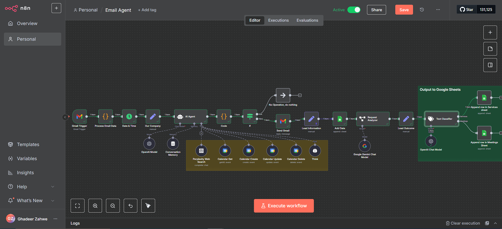

# Email Agent Workflow with n8n

This project is an **Email Workflow Assistant** built using **[n8n](https://n8n.io/)**.  
It acts as an **AI-powered personal email assistant** to handle messages, reply automatically, perform **live web searches via Perplexity AI**, manage Google Calendar events, log interactions into Google Sheets, and enforce strict business boundaries.

---

## 🚀 Overview

The **Email Agent Workflow Assistant** is designed to:
- **Reply to emails** with context-aware, professional answers.  
- **Provide information about company services** directly from a structured knowledge base.  
- **Research topics** and provide **resources + live web search results** using **Perplexity AI**.  
- **Create, update, fetch, and delete calendar events** directly in Google Calendar.  
- **Log user messages & decisions** into **Google Sheets**.  
- **Respect privacy & business rules** (no sensitive data leaks, no meetings outside working hours).  
- **Automate communication** while staying reliable, structured, and professional.  

---

## 🛠️ Technology Stack

- **[n8n](https://n8n.io/)** → Workflow automation engine.  
- **[OpenAI GPT-4](https://platform.openai.com/)** & **[Google Gemini](https://ai.google/)** → Natural language understanding & response generation.  

- **[Perplexity API](https://www.perplexity.ai/)** → Live web search & research tool.  

- **[Google Cloud APIs](https://console.cloud.google.com/)** → Gmail, Calendar, and Sheets integration.  

- **[Hostinger VPS](https://www.hostinger.com/vps-hosting)** → Server hosting (recommended plan: **KVM2**).  

- **[Coolify](https://coolify.io/)** → Self-hosted platform with OS panel.
  

- **[GoDaddy](https://www.godaddy.com/)** → Domain registration & DNS setup.  

---

## 📂 Workflow Sections

### 1. **Role & Context**
- The agent role: *AI-powered email, scheduling, and services assistant*.  
- Processes incoming emails, interprets intent, and takes appropriate actions.  
- Always includes **context**:
  - Current date/time (Asia/Beirut).  
  - Email metadata (sender, subject, time received).  
  - Company service knowledge base.  

---

### 2. **Instructions & Rules**

- ✅ Allowed:
  - Reply to professional service-related emails.  
  - Provide research insights using **Perplexity AI**.  
  - Provide **company service information** from the knowledge base.  
  - Create, update, delete, and fetch Google Calendar events.  
  - Log all processed requests to **Google Sheets**.  
  - Log all processed requests to Google Sheets (Add AI-enriched fields after analyzing the email message).

- ❌ Restricted:
  - NEVER disclose sensitive meeting details (attendees, private notes).  
  - NEVER schedule meetings on weekends.  
  - NEVER suggest times outside **9 AM – 5 PM, Monday–Friday**.  
  - NEVER double-book or suggest overlapping slots.  
  - NEVER reply to **promotions, newsletters, or unrelated content**.  

- ⚡ Must Always:
  - Check **Google Calendar availability** before suggesting slots.  
  - Confirm **meetings, updates, and cancellations**.  
  - Format all dates/times in **ISO format (Asia/Beirut timezone)**.  

---

## 🌍 Hosting & Deployment

### Hosting Setup
- VPS: [Hostinger KVM2](https://www.hostinger.com/vps-hosting) → Balanced performance & scalability.  
- Choose a region closest to your users (e.g., France or Germany for Lebanon-based clients).  

### Coolify Installation
1. Deploy **Coolify OS with Panel**.  
2. Add project → `n8n` → set **Production** environment.  
3. Add **n8n with Postgres** (recommended for stability).  
4. Replace default domain with **GoDaddy custom domain**.  
5. Enable **SSL (https)**.  

### Activation & Security
- Request free **n8n license key** and activate via email.  
- Enable **2FA** in n8n for security.  
- Store sensitive keys in encrypted environment variables.  

---

## Testing Guide

1. **Ask about company services** → Agent provides knowledge-base response.  

2. **Ask about AI trends** → Agent provides insights via Perplexity.  

3. **Book meeting** → Suggests available slots (Mon–Fri, 9 AM–5 PM), checks calendar, and confirms.  

4. **Confirm meeting** → Saves event to Google Calendar.  

5. **Update meeting** → Reschedules event correctly.  

6. **Cancel meeting** → Removes event from calendar.  

7. **Boundary test** → Rejects after-hours/weekend requests.  

8. **Privacy test** → Refuses to share sensitive data.  

9. **Logging test** → Records all interactions in Google Sheets.  

---

## Notes on Workflow

- Workflow **triggers automatically** on incoming email (via Gmail Trigger / IMAP).  
- Analyzes content with AI (OpenAI/Gemini) → decides if the message is a **service request** or **meeting request**.  
- Replies accordingly using company knowledge base or live research.  
- Performs **calendar operations** (create, update, delete, fetch).  
- Logs every action to **Google Sheets** for tracking.  
- Strict enforcement of **privacy, security, and business rules**.  

---

## 🔗 Useful Links
- **n8n** → https://n8n.io/  
- **OpenAI API** → https://platform.openai.com/  
- **Google Gemini** → https://ai.google/  
- **Perplexity API** → https://www.perplexity.ai/  
- **Google Cloud APIs** → https://console.cloud.google.com/  
- **Hostinger VPS** → https://www.hostinger.com/vps-hosting  
- **GoDaddy Domains** → https://www.godaddy.com/  
- **Coolify** → https://coolify.io/  

---

## 📂 Workflow Import & Setup

The **Email Agent Workflow** is provided as a **JSON file** that can be directly imported into **n8n**.  

### Steps to Import:
1. Open your **n8n instance** in a browser.  
2. Click on the **three dots** (top-right corner).  
3. Select **Import from File**.  
4. Choose the provided **workflow JSON file** and import.  

### Personalize the AI Agent:
- Open the **AI Agent node** inside n8n.  
- Update the **prompt** with your rules and instructions.  
- Save the workflow after updating the prompt.  

### Start Using:
- Once imported and personalized, the workflow runs **automatically** on incoming emails after you activate it.
  
- Calendar operations, service replies, logging, and research are ready to use.  
- No further setup is required after API keys and environment variables are configured.  
